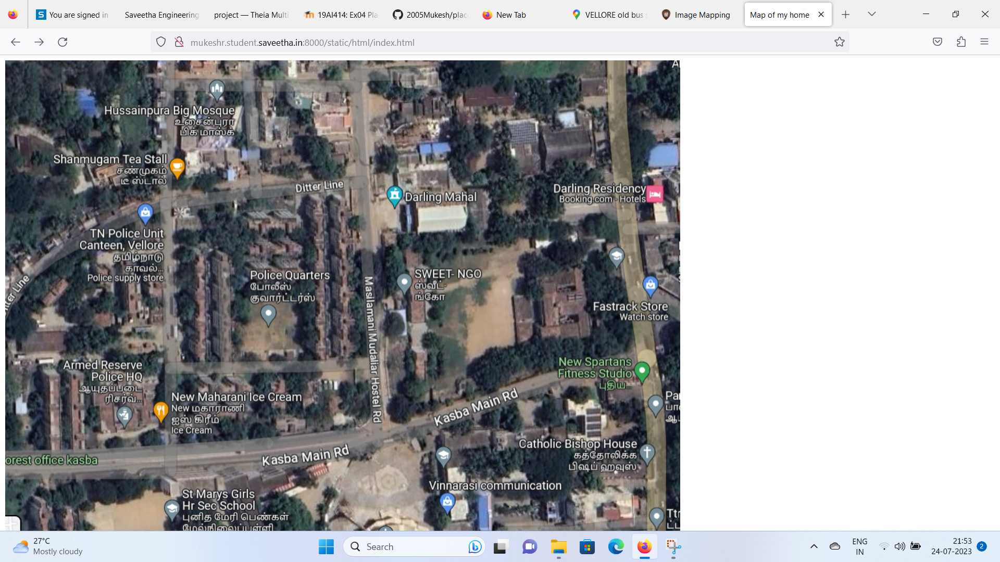
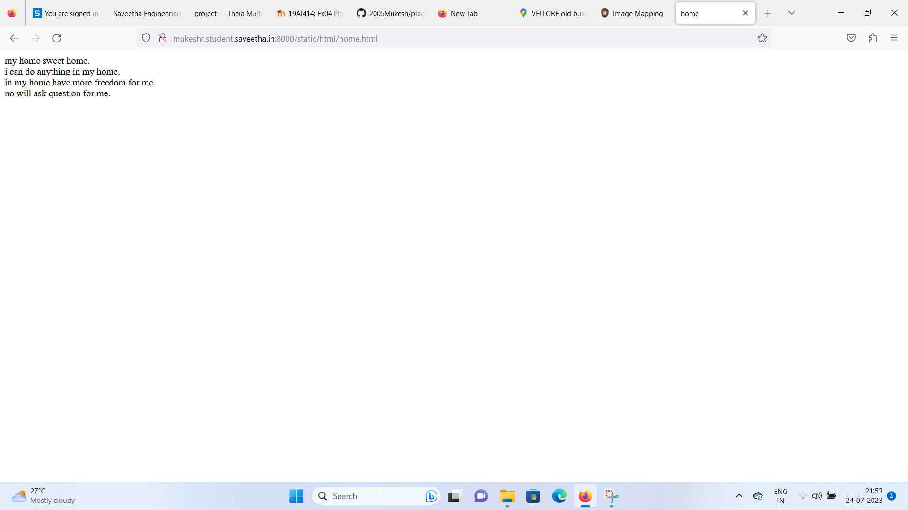
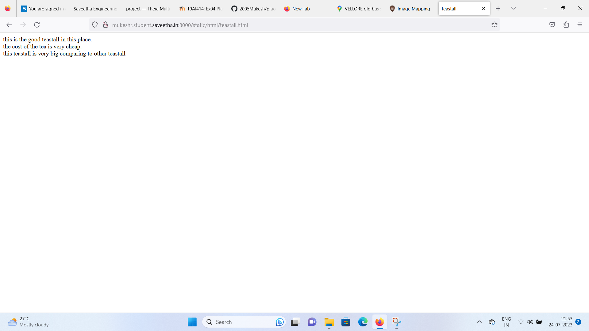
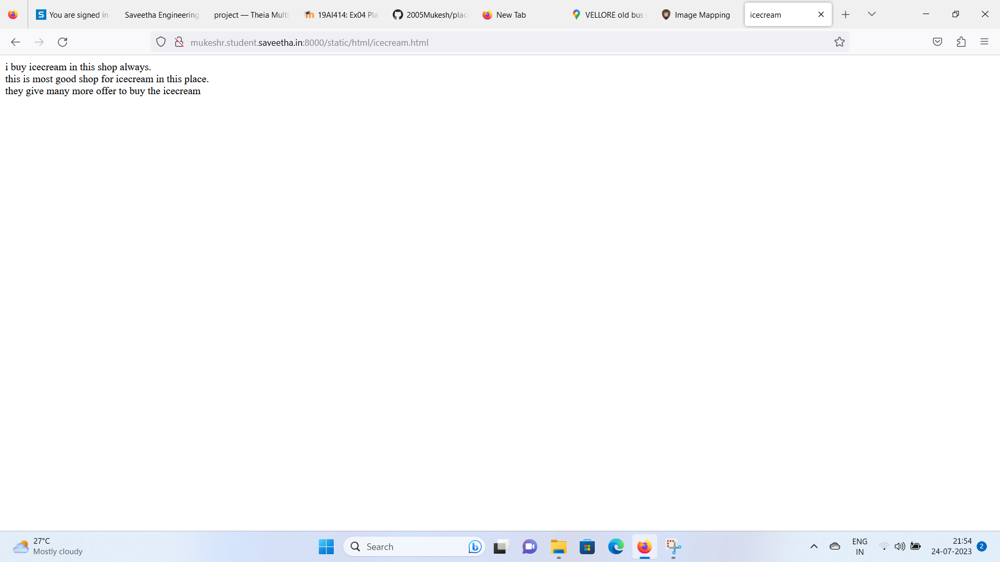
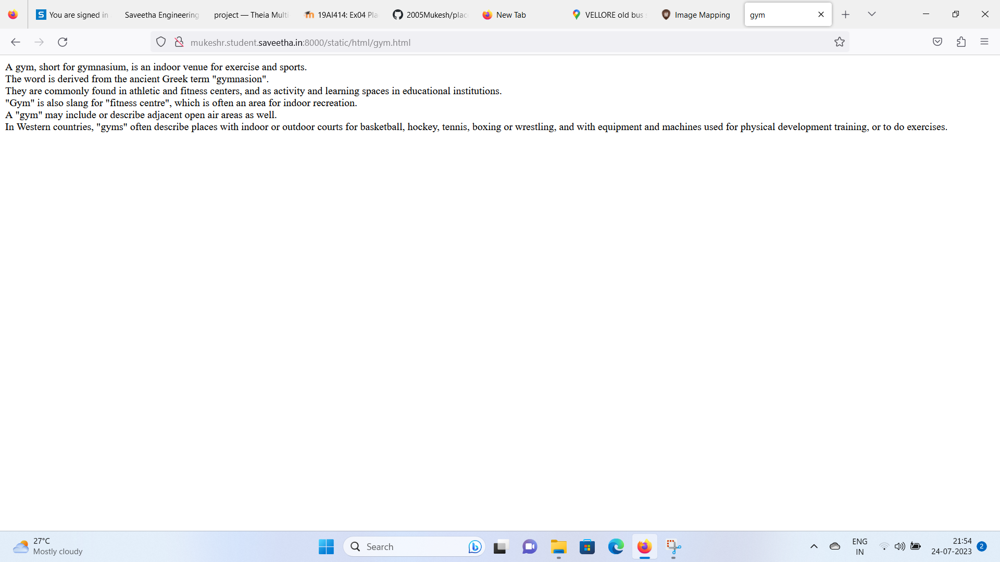

# Places Around Me
## AIM:
To develop a website to display details about the places around my house.

## Design Steps:

### Step 1:
Create 'ex04' directory
### Step 2:
Create project 'myproj' using "django-admin startproject myproj"
### Step 3:
Create myapp using "python3 manage.py startapp myapp"
### Step 4:
Create image map using image-maps.com
### Step 5:
Create necessary webpages for the places on the map
### Step 6:
Push to README.md and push to Github repository

## Code:
### index.html:
```html
<!DOCTYPE html>
<html>
    <head>
        <title>
            Map of my home
        </title>
    </head>
    <body>
        
        <map name="image-maps-2023-07-24-154826" id="ImageMapsCom-image-maps-2023-07-24-154826">
        <area  alt="" title="Home" href="home.html" shape="rect" coords="320,284,483,370" style="outline:none;" target="_self"     />
        <area  alt="" title="Teastall" href="teastall.html" shape="rect" coords="168,132,331,218" style="outline:none;" target="_self"     />
        <area  alt="" title="Icecream" href="icecream.html" shape="rect" coords="228,501,391,587" style="outline:none;" target="_self"     />
        <area  alt="" title="Mahal" href="mahal.html" shape="rect" coords="573,184,736,270" style="outline:none;" target="_self"     />
        <area  alt="" title="gym" href="gym.html" shape="rect" coords="853,449,1009,542" style="outline:none;" target="_self"     />
        <area shape="rect" coords="1035,766,1037,768" alt="Image Map" style="outline:none;" title="Image Map" href="https://www.image-maps.com/" />
        </map>
    </body>
</html>
```
### home.html:
```html
<!DOCTYPE html>
<html>
    <head>
        <title>home</title>
    </head>
    <body>
        my home sweet home.
        <br>
        i can do anything in my home.
        <br>
        in my home have more freedom for me.
        <br>
        no will ask question for me.
        <br>
    </body>
</html>
```
### teastall.html:
```html
<!DOCTYPE html>
<html>
    <head>
        <title>teastall</title>
    </head>
    <body>
        this is the good teastall in this place.
        <br>
        the cost of the tea is very cheap.
        <br>
        this teastall is very big comparing to other teastall
        <br>
     </body>
</html>
```
### icecream.html:
```html
<!DOCTYPE html>
<html>
    <head>
        <title>icecream</title>
    </head>
    <body>
        i buy icecream in this shop always.
        <br>
        this is most good shop for icecream in this place.
        <br>
        they give many more offer to buy the icecream
        <br>
     </body>
</html>
```
### gym.html:
```html
<!DOCTYPE html>
<html>
    <head>
        <title>gym</title>
    </head>
    <body>
        A gym, short for gymnasium, is an indoor venue for exercise and sports. 
        <br>
        The word is derived from the ancient Greek term "gymnasion".
        <br>
         They are commonly found in athletic and fitness centers, and as activity and learning spaces in educational institutions.
         <br>
          "Gym" is also slang for "fitness centre", which is often an area for indoor recreation.
          <br>
          A "gym" may include or describe adjacent open air areas as well.
          <br>
          In Western countries, "gyms" often describe places with indoor or outdoor courts for basketball, hockey, tennis, boxing or wrestling, and with equipment and machines used for physical development training, or to do exercises.
          <br>
    </body>
</html>
```
### mahal.html:
```html
<!DOCTYPE html>
<html>
    <head>
        <title>mahal</title>
    </head>
    <body>
        this is the good mahal in this place.
        <br>
        the rent of the mahal is very cheap.
        <br>
        this mahal is very big comparing to other mahal
        <br>
     </body>
</html>
```
## Output:
### index.html:


### home.html:


### teastall.html:


### icecream.html:


### gym.html:


### mahal.html:


## Result:
Image-maps has been created successfully